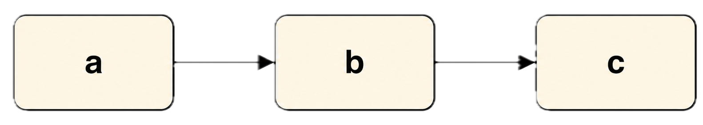

<!-- _class: title lead -->
# Faster and More Predictable
## Value Stream Mapping workshop
### Tim Ottinger

---
<!-- _class: workshop -->
# Outcomes by end of session

- Read a Current State VSM.
- Draw a Progressing State VSM.
- Understand Flow Better
- Diagnose a delivery system.
- Predict and sketch improvements.

---
<!-- _class: workshop -->
# Working pattern (repeat each scenario)
- Observation
- Interpretation
- Prediction
- Reveal
- Theory

---
<!-- _class: workshop -->

# VSM notation quickstart

---

# Not Just Process Flow

There are some processes where they only show the steps used to produce a product in their system.

This might be minimally useful, but only as documentation.

We will explore more deeply...

---
# Stations

The main flow is a series of work "stations" separated by queues.  Queues are important to understanding the flow of work.

CT = Average cycle time

Other measures will be provided later.

---
# Connectedness

Every handoff is a queue, represented with a triangle.

Inside the triangle is the queue's population.

If we assume that each stage has 100 availability

$$
WT = queued \times cycle time.
$$

---

# Lead Time Ladder

The raised part of the lead time ladder is wait time, and the lowered part is work time 

---
# Uses

1. To show the current state
2. To tweak the efficiency (work time / total time)
3. Build a map of the next desired change

For software orgs, efficiency is often less than 10%. 

---

# Process Efficiency

Consider one item travelling through the queue. 

How often and how long does the work wait?

$$
Efficiency = \frac{T(work)}{T(total)}
$$

The more time work is waiting in queues, the less efficient the VSM shows it to be.

---

# Typical Inefficiencies

The "ideal" time for a given process is the sum of the cycle times. If there was no delay at all, this would be the time to delivery. 

Work can wait for:
* Integration (if task are dependent and partial)
* Batching (if the release is partial)
* Busy or Unavailable queue readers

---
# Unintended Consequences

We must be aware of queuing and efficiency. Some consequences of ignoring the process are:

* Late Deliveries
* Escaped Defects
* Uncertain Completion Dates
* Uncertain Completion Status
* Uncertain Quality

---
<!-- _class: split -->
# What to inspect in any map
## Structural signals
- Every handoff is a queue.
- Scatter creates gather.
- Constraints govern throughput.
## Flow signals
- Inventory creates delay.
- Rework creates loops.
- First-time-through drives flow.

---
# POSIWID lens

> The purpose of a system is what it does.  - Stafford Beer \
> Every system is perfectly designed to get the result that it does. - W.E. Deming

The design as-is may be wholly comprised of unintended consequences. 

---
<!-- _class: workshop -->
# Diagnostic question set
- Where is work waiting?
- Where are gathers?
- What is the current constraint?
- What causes rework?
- Is this system optimized to start work or finish work?

---
<!-- _class: workshop -->
---
# Long Wait Time Causes

| Usually First    | Check Next          |
| ---------------- | ------------------- |
| Too much WIP     | Review bottleneck   |
| Large work items | Partial completion  |
| Rework           | Merge delays        |
| Dependencies     | Release constraints |

**Wait Time ≫ Cycle Time → investigate the system**

---
# Simple outline (today)
1. Read map signals: queue, CT, WT, and reject paths.
2. Diagnose common flow failures (Scenarios 1-4).
3. Diagnose system traps (Scenarios 5-7).
4. Compare with a high-performance pattern (Scenario 8).
5. Run a capstone redesign from evidence.

---
# Scenario generation map
After DSL edits, run `npm run vsm:generate`.
- `too-much-wip-team.vsm.yaml` → `too-much-wip-team.svg`
- `review-bottleneck.vsm.yaml` → `review-bottleneck.svg`
- `shift-right-team.vsm.yaml` → `shift-right-team.svg`
- `dependency-team.vsm.yaml` → `dependency-team.svg`

---
# Scenario generation map (continued)
- `partial-completion-team.vsm.yaml` → `partial-completion-team.svg`
- `merge-hell-team.vsm.yaml` → `merge-hell-team.svg`
- `release-train-team.vsm.yaml` → `release-train-team.svg`
- `high-performance-team.vsm.yaml` → `high-performance-team.svg`

---
<!-- _class: practice -->
# Scenario 1 — The "Too Much WIP" Team

- Backlog `△ 120`, Ready `△ 25`
- Lesson: Work isn't moving slowly. Too much work is started.
- Improvement: Reduce WIP.

---
<!-- _class: practice -->
# Scenario 2 — The Review Bottleneck

- Lesson: Review takes minutes. Waiting for review takes days.
- Improvement: Smaller PRs, more reviewers, earlier review.

---
<!-- _class: practice -->
# Scenario 3 — The Shift-Right Team

- Rework loop: `30%` return to Development.
- Lesson: Testing isn't the bottleneck. Defects are.
- Improvement: Move quality practices into development.

---
<!-- _class: practice -->
# Scenario 4 — The Dependency Team

- Investigation: Why 9 days?
- Waiting on: Security Team, Database Team, Operations Team.
- Lesson: Dependencies dominate lead time.

---
<!-- _class: practice -->
# Scenario 5 — The Partial Completion Team

- Investigation: Frontend/backend complete but docs missing (or 4 of 5 stories complete).
- Lesson: Almost done is not done; synchronization effects dominate.

---
<!-- _class: practice -->
# Scenario 6 — The Merge Hell Team

- Additional metrics: Conflict Rate `25%`, Merge Failures `12%`.
- Lesson: Coding is not the constraint. Branching strategy is.
- Connects directly to Tornhill's work.

---
<!-- _class: practice -->
# Scenario 7 — The Release Train Team

- Lesson: Release batching destroys flow.
- Improvement: Smaller releases.

---
<!-- _class: practice -->
# Scenario 8 — The High-Performance Team

- Quality gates: Static Analysis `98%`, Unit Tests `97%`, Integration `95%`.
- Lesson: Nothing magical.
- Small batches. Low WIP. Fast feedback. Strong quality practices.

---
<!-- _class: workshop -->
# Capstone diagnosis
- Identify the constraint.
- Identify gather points.
- Explain delays from evidence.
- Predict outcomes of one intervention.
- Sketch a revised map.

---
<!-- _class: workshop -->
# Capstone evidence pack
- VSM snapshot
- Flow metrics
- Quality metrics
- DORA metrics
- Optional AI metrics

---
<!-- _class: split -->
# Evidence roots
## Workshop backbone
- `Faster-and-More-Predictable-Workshop-Summary.md`
- `Workshop-Principles-Sources.md`
- `roots.md`
- `Source-Type-Whyitmatters.csv`
## Discussion anchors
- Queueing / Little’s Law
- Wait states and handoffs
- Rework loops and first-time-through

---
<!-- _class: workshop -->
# Final message
- The map is evidence.
- Principles explain evidence.
- Interventions should improve flow.

Goal: explain current behavior, then change system design to produce better outcomes.

