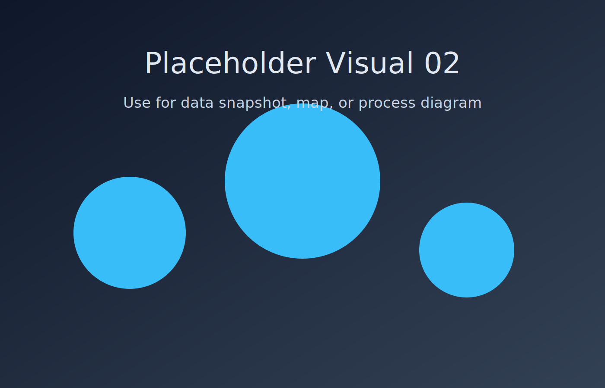

<!-- _class: title lead -->
# Faster and More Predictable
## Value Stream Mapping workshop
### Skill transfer over lecture

---
<!-- _class: workshop -->
# Workshop contract
- We learn by diagnosing systems.
- We avoid blame and recrimination.
- We optimize for flow, not local utilization.

---
<!-- _class: workshop -->
# Outcomes by end of session
- Read a VSM.
- Draw a VSM.
- Diagnose a delivery system.
- Predict and sketch improvements.

---
<!-- _class: workshop -->
# Working pattern (repeat each scenario)
- Observation
- Interpretation
- Prediction
- Reveal
- Theory

---
<!-- _class: workshop -->
# POSIWID lens
> The purpose of a system is what it does.

Prompt: What is this system actually optimized for?

---
# VSM notation quickstart

△ 14 means 14 items waiting in queue.

Process box: show name + CT + WT.

Waiting work is not the same as active progress.

---
<!-- _class: split -->
# What to inspect in any map
## Structural signals
- Every handoff is a queue.
- Scatter creates gather.
- Constraints govern throughput.
## Flow signals
- Inventory creates delay.
- Rework creates loops.
- First-time-through drives flow.

---
<!-- _class: workshop -->
# Diagnostic question set
- Where is work waiting?
- Where are gathers?
- What is the current constraint?
- What causes rework?
- Is this system optimized to start work or finish work?

---
# Scenario sequence
1. Healthy Team
2. Specialist Organization
3. High Inventory
4. Scatter-Gather
5. Shift Left / Higher First-Time-Through
6. AI Amplification
7. Constraint Migration
8. Capstone Diagnosis

---
<!-- _class: practice -->
# Scenario 1 — Healthy Team

Prompt: What keeps queue levels stable here?

---
<!-- _class: practice -->
# Scenario 2 — Specialist Organization

Prompt: Which handoff first becomes a visible queue?

---
<!-- _class: practice -->
# Scenario 3 — High Inventory

Prompt: Use Little’s Law intuition — what happens to lead time as inventory rises?

---
<!-- _class: practice -->
# Scenario 4 — Scatter-Gather

Prompt: Where does synchronization dominate elapsed time?

---
<!-- _class: practice -->
# Scenario 5 — Shift Left / Higher FTT

Prompt: Which loops disappear when first-time-through improves?

---
<!-- _class: practice -->
# Scenario 6 — AI Amplification

Prompt: What got faster? What queue got longer?

---
<!-- _class: practice -->
# Scenario 7 — Constraint Migration

Prompt: After one bottleneck improves, where does the new constraint appear?

---
<!-- _class: workshop -->
# Capstone diagnosis
- Identify the constraint.
- Identify gather points.
- Explain delays from evidence.
- Predict outcomes of one intervention.
- Sketch a revised map.

---
<!-- _class: workshop -->
# Capstone evidence pack
- VSM snapshot
- Flow metrics
- Quality metrics
- DORA metrics
- Optional AI metrics

---
<!-- _class: split -->
# Evidence roots
## Workshop backbone
- `Faster-and-More-Predictable-Workshop-Summary.md`
- `Workshop-Principles-Sources.md`
- `roots.md`
- `Source-Type-Whyitmatters.csv`
## Discussion anchors
- Queueing / Little’s Law
- Wait states and handoffs
- Rework loops and first-time-through

---
<!-- _class: workshop -->
# Final message
- The map is evidence.
- Principles explain evidence.
- Interventions should improve flow.

Goal: explain current behavior, then change system design to produce better outcomes.

